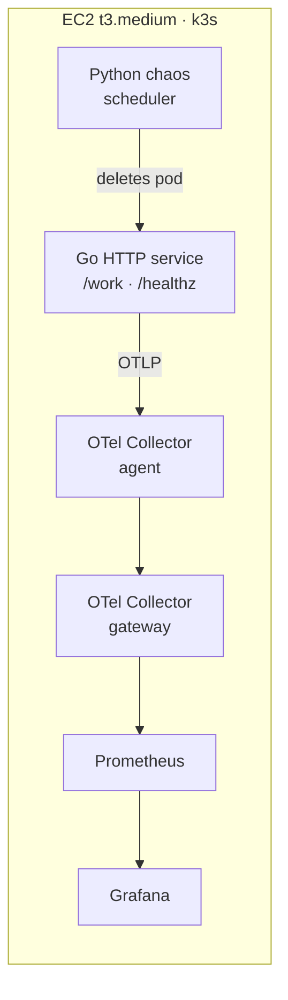

# Chaos Gym

A Kubernetes cluster that breaks itself on a schedule, so I can practice
diagnosing real failures against real dashboards.

Reading a postmortem teaches you what an outage looked like to someone else.
This is a rig for having the experience yourself: a Go service instrumented with
OpenTelemetry, its telemetry flowing through an OpenTelemetry Collector into
Prometheus and Grafana, and a Python scheduler that kills the service on purpose
while I try to name what broke from the dashboard alone.

It runs on one small EC2 instance on real AWS — real IAM, real VPC, real
security groups — because the parts that are easy to skip locally are the parts
worth practicing.

## Architecture



The point of the Collector sitting in the middle, rather than the service
writing straight to Prometheus, is that it's the vendor-neutral seam. Swapping
the backend is a Collector config change, not a code change in every service.

**k3s rather than managed EKS.** EKS charges ~$73/month for its control plane,
which buys high availability that solo practice does not need. k3s on one
instance gives the same Kubernetes API for the price of the box.

**Access is via SSM Session Manager, not SSH.** The security group has zero
inbound rules — no port 22, nothing. The instance's SSM agent dials out, and
access is authorized by IAM rather than by knowing an IP. Nothing on the
internet can open a connection to this box.

## Status

Phase 1, partly built. Honest state:

| Step | What | Status |
|------|------|--------|
| 1 | AWS Budget alarm | Done |
| 2 | VPC, subnet, security group | Done |
| 3 | EC2 instance, IAM role, k3s, budget auto-stop | Done |
| 4 | Go HTTP service | Builds and tests; not containerized yet |
| 5 | OpenTelemetry instrumentation | Not started |
| 6 | k8s manifests for service + Collector agent | Not started |
| 7 | Collector gateway + kube-prometheus-stack | Not started |
| 8 | Python chaos scheduler | Not started |
| 9 | End to end: read the dashboard, name the failure | Not started |

Phase 2, once phase 1 works end to end: Postgres and Redis behind the service,
load testing, and a wider failure menu — latency injection, bad rollouts,
database slowdown, telemetry overload — each ending in a written incident
report.

## Cost, and the guardrails

The whole thing runs on one `t3.medium`, which is ~$35/month if left on and
~$1.60/month stopped. Two guardrails exist because a learning project should
not be able to surprise you with a bill:

An **AWS Budget alarm** at $20/month emails at 80% of actual spend and 100% of
forecasted spend. It is deliberately configured with `include_credit = false`,
so promotional credits do not mask real usage — otherwise the alarm stays
silent for as long as the credits last and then a full-price bill arrives with
no warning.

A **budget action** automatically stops the instance if actual spend reaches
100% of the budget. It stops rather than terminates, so the disk and everything
on it survive, and its IAM policy is scoped to one instance ARN so it cannot
touch anything else in the account.

Instance sizing was settled by measurement, not guesswork. A `t3.micro` ran its
CPU credit balance to zero during the k3s install and throttled so hard that
remote commands queued instead of executing. k3s alone idles at ~760MB, so
`t3.small`'s 2GB would not have left room for Prometheus, Grafana, and the
Collector.

## Running it yourself

You need Terraform, the AWS CLI with credentials for an account you own, Go 1.26+,
and Docker.

```bash
cd terraform
cp terraform.tfvars.example terraform.tfvars   # then put your email in it
terraform init
terraform plan                                  # read this before applying
terraform apply
```

This creates billable resources — an EC2 instance, mainly. The budget alarm is
the first resource in the file on purpose, so nothing billable exists before
something is watching the bill. Read the plan output before you apply it.

Connect to the instance without any open port:

```bash
aws ssm start-session --target <instance-id>
```

Stop it when you are not using it:

```bash
aws ec2 stop-instances --instance-ids <instance-id>
```

Run the Go service locally:

```bash
cd app
go test ./...
go run .
curl localhost:8080/work
```

## Layout

- `app/` — the Go HTTP service that gets broken on purpose
- `terraform/` — AWS: budget guardrails, network, instance, IAM. Local state
- `src/chaos_gym/` — the Python scheduler that does the killing
- `k8s/` — manifests for the service, Collector, and monitoring stack (not yet built)
- `DECISIONS.md` — why things were chosen, in my own words
