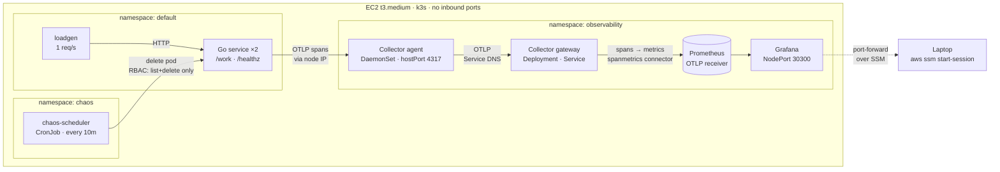

# Chaos Gym

A Kubernetes cluster that breaks itself on a schedule, so I can practice
diagnosing real failures against real dashboards.

Reading a postmortem teaches you what an outage looked like to someone else.
This is a rig for having the experience yourself: a Go service instrumented with
OpenTelemetry, its telemetry flowing through an OpenTelemetry Collector into
Prometheus and Grafana, and a Python scheduler that kills the service on purpose
while I try to name what broke from the dashboard alone.

It runs on one small EC2 instance on real AWS — real IAM, real VPC, real
security groups — because the parts that are easy to skip locally are the parts
worth practicing.

## Architecture



Three things in that picture are the whole design.

**The Collector sits in the middle** rather than the service writing straight to
Prometheus, because it's the vendor-neutral seam. Swapping the backend is a
Collector config change, not a code change in every service.

**Agent and gateway are reached differently, on purpose.** The app finds its
agent via the node's IP from the downward API, because a DaemonSet is one pod
per node and a Service would load-balance across nodes — the opposite of what a
node-local agent is for. The agent finds the gateway via ordinary Service DNS,
because there the load-balancing is exactly right.

**Metrics are derived, not instrumented.** The Go service emits only traces. The
gateway's `spanmetrics` connector turns those spans into request rate, error
rate, and duration, and pushes them into Prometheus over OTLP. There is a
working RED dashboard before a single metrics SDK call exists in the service.

**k3s rather than managed EKS.** EKS charges ~$73/month for its control plane,
which buys high availability that solo practice does not need. k3s on one
instance gives the same Kubernetes API for the price of the box.

**Access is via SSM Session Manager, not SSH.** The security group has zero
inbound rules — no port 22, nothing. The instance's SSM agent dials out, and
access is authorized by IAM rather than by knowing an IP. Nothing on the
internet can open a connection to this box.

## Status

Phase 1, partly built. Honest state:

| Step | What | Status |
|------|------|--------|
| 1 | AWS Budget alarm | Done |
| 2 | VPC, subnet, security group | Done |
| 3 | EC2 instance, IAM role, k3s, budget auto-stop | Done |
| 4 | Go HTTP service | Done — 2.5MB `scratch` image, 2 replicas on k3s |
| 5 | OpenTelemetry instrumentation | Traces done; metrics not started |
| 6 | k8s manifests for service + Collector agent | Done — spans reaching the agent |
| 7 | Collector gateway + kube-prometheus-stack | Done — span metrics in Prometheus, Grafana up |
| 8 | Python chaos scheduler | Done — CronJob, least-privilege RBAC, verified kill |
| 9 | End to end: read the dashboard, name the failure | Ready — dashboard live, runbook below |

Phase 2, once phase 1 works end to end: Postgres and Redis behind the service,
load testing, and a wider failure menu — latency injection, bad rollouts,
database slowdown, telemetry overload — each ending in a written incident
report.

## Cost, and the guardrails

The whole thing runs on one `t3.medium`, which is ~$35/month if left on and
~$1.60/month stopped. Two guardrails exist because a learning project should
not be able to surprise you with a bill:

An **AWS Budget alarm** at $20/month emails at 80% of actual spend and 100% of
forecasted spend. It is deliberately configured with `include_credit = false`,
so promotional credits do not mask real usage — otherwise the alarm stays
silent for as long as the credits last and then a full-price bill arrives with
no warning.

A **budget action** automatically stops the instance if actual spend reaches
100% of the budget. It stops rather than terminates, so the disk and everything
on it survive, and its IAM policy is scoped to one instance ARN so it cannot
touch anything else in the account.

Instance sizing was settled by measurement, not guesswork. A `t3.micro` ran its
CPU credit balance to zero during the k3s install and throttled so hard that
remote commands queued instead of executing. k3s alone idles at ~760MB, so
`t3.small`'s 2GB would not have left room for Prometheus, Grafana, and the
Collector.

## Running it yourself

You need Terraform, the AWS CLI with credentials for an account you own, Go 1.26+,
and Docker.

```bash
cd terraform
cp terraform.tfvars.example terraform.tfvars   # then put your email in it
terraform init
terraform plan                                  # read this before applying
terraform apply
```

This creates billable resources — an EC2 instance, mainly. The budget alarm is
the first resource in the file on purpose, so nothing billable exists before
something is watching the bill. Read the plan output before you apply it.

Connect to the instance without any open port:

```bash
aws ssm start-session --target <instance-id>
```

Stop it when you are not using it:

```bash
aws ec2 stop-instances --instance-ids <instance-id>
```

Run the Go service locally:

```bash
cd app
go test ./...
go run .
curl localhost:8080/work
```

## Using it — one session, start to finish

The instance is stopped between sessions to keep the bill near zero, so every
session starts by waking it up and ends by putting it back to sleep.

**1. Start the box** (~60s until the k3s API answers):

```bash
aws ec2 start-instances --instance-ids <instance-id>
aws ec2 wait instance-running --instance-ids <instance-id>
```

**2. Redeploy.** This is not optional: the ECR pull secret is built from a token
that expires after 12 hours, so without this the pods cannot pull their images.

```bash
aws ssm send-command --instance-ids <instance-id> \
  --document-name AWS-RunShellScript \
  --parameters 'commands=["bash /opt/chaos-gym/deploy.sh"]'
```

**3. Open the tunnel.** Leave this running in its own terminal. Nothing is
exposed to the internet — the security group still has zero inbound rules, and
this rides the SSM agent's outbound connection, authorised by IAM.

```bash
aws ssm start-session --target <instance-id> \
  --document-name AWS-StartPortForwardingSession \
  --parameters '{"portNumber":["30300"],"localPortNumber":["3000"]}'
```

**4. Get the Grafana password** (generated by the chart, never stored in a
manifest) and log in at http://localhost:3000 as `admin`:

```bash
aws ssm send-command --instance-ids <instance-id> \
  --document-name AWS-RunShellScript \
  --parameters 'commands=["k3s kubectl -n observability get secret kube-prometheus-stack-grafana -o jsonpath={.data.admin-password} | base64 -d"]'
```

**5. Open the "Chaos Gym — service health" dashboard** and let it sit. A
load generator sends one request per second, so the graphs are never empty. The
chaos scheduler fires every 10 minutes on its own; to force one immediately:

```bash
aws ssm send-command --instance-ids <instance-id> \
  --document-name AWS-RunShellScript \
  --parameters 'commands=["k3s kubectl -n chaos delete job manual-kill --ignore-not-found","k3s kubectl -n chaos create job manual-kill --from=cronjob/chaos-scheduler","sleep 5","k3s kubectl -n chaos logs job/manual-kill"]'
```

**6. Diagnose it from the dashboard before reading the logs.** That is the whole
exercise. Name what happened, then check yourself:

| What you should see | What it means |
|---|---|
| **Running replicas** drops 2 → 1, back to 2 | A pod was killed and the ReplicaSet replaced it |
| **Pod lifecycle** — one line ends, a new one begins | Which pod died, and when |
| **Latency p95** briefly rises | Requests in flight during the drain |
| **Non-2xx** stays flat at zero | The SIGTERM handler drained cleanly — no request was dropped |

If non-2xx is *not* flat, that is the interesting case: something was accepted
and then lost, which means the drain did not work.

**7. Stop the box** when you are done. The chaos scheduler only fires while it
is running.

```bash
aws ec2 stop-instances --instance-ids <instance-id>
```

## Layout

- `app/` — the Go HTTP service that gets broken on purpose
- `terraform/` — AWS: budget guardrails, network, instance, IAM, ECR. Local state
- `src/chaos_gym/` — the Python scheduler that does the killing
- `k8s/` — every manifest: app, load generator, Collector agent and gateway,
  monitoring stack, Grafana dashboard, PodMonitors, chaos scheduler and its RBAC
- `deploy.sh` — applies all of it; run at session start to refresh the ECR token
- `QUESTIONS.md` — comprehension questions captured while building, reviewed per phase
- `DECISIONS.md` — why things were chosen, in my own words
