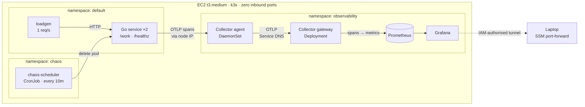

# Chaos Gym

[](https://github.com/jmenzies722/chaos-gym/actions/workflows/ci.yml)
[](LICENSE)

**A Kubernetes cluster that breaks itself on a schedule, so I can practise
diagnosing real failures from a dashboard instead of reading about them.**

Reading a postmortem teaches you what an outage looked like to somebody else.
This is a rig for having the experience yourself. A Go service runs in a real
cluster on real AWS. A Python scheduler kills one of its pods every ten
minutes. Telemetry flows through an OpenTelemetry Collector into Prometheus and
Grafana, and the exercise is to look at the dashboard and say what happened
before checking whether I was right.

The infrastructure is the setup. **The diagnoses are the point** — there are
three real ones further down, including one where the dashboard itself was
lying.

---

## How it works



Follow one request through it. The load generator calls `/work`. The Go
service handles it and OpenTelemetry records a **span** — a timed record of
that one request. The span goes to the **agent**, a Collector running on the
same node, which acts as a local drop-box so the service never waits on a
backend. The agent forwards to the **gateway**, one Collector for the whole
cluster, where cluster-wide decisions live: it drops health-probe spans and
converts the rest into metrics. Those go to **Prometheus**, and **Grafana**
draws them.

Meanwhile the chaos scheduler deletes a pod. The service loses a replica,
Kubernetes replaces it, and the dashboard has to show whether anyone was hurt.

### Three design decisions that shape everything

**The Collector sits in the middle** instead of the service writing straight to
Prometheus. That's the vendor-neutral seam: swapping the backend becomes a
Collector config change rather than a code change in every service.

**The agent and the gateway are reached in opposite ways, deliberately.** The
app finds its agent through the node's IP, injected by Kubernetes' downward
API — because a DaemonSet is one pod *per node*, and a Service would
load-balance across nodes, sending spans to some other machine's agent. The
agent finds the gateway through ordinary Service DNS, because there
load-balancing is exactly what you want. Same protocol, opposite requirement.

**Metrics are derived, not instrumented.** The Go service emits only traces.
The gateway's `spanmetrics` connector turns those spans into request rate,
error rate, and duration — the RED method — and pushes them to Prometheus over
OTLP. There is a complete latency dashboard without a single metrics SDK call
in the service.

---

## Three things it caught

These are the reason the rig exists.

### 1. The dashboard was lying about latency

p95 read **242ms** for a service that takes 100ms and was completely healthy.

Prometheus doesn't store every request's duration. It stores counts per
**bucket** — how many finished under 50ms, under 100ms, under 250ms — and a
percentile is interpolated *inside* whichever bucket it lands in. A bucket
boundary sat at exactly 100ms, the service's own typical latency, so every
normal request fell into the 100→250ms bucket and the maths guessed 242ms.

Moving the boundaries either side of the mode, changing nothing else:
p50 **100ms**, p95 **109ms**.

> A quantile is only as precise as the bucket it falls into, and a boundary
> sitting on your typical latency is the worst possible place for one.

### 2. Grafana was being killed and its logs said nothing

It died roughly every thirty minutes, never at startup. Exit code **137** —
that's `128 + 9`, so SIGKILL. Not Kubernetes asking politely: the kernel
enforcing a cgroup memory limit, with no grace period and no chance to log.

The tell was the previous container's log ending mid-sentence with no error at
all. Grafana builds in-memory search indexes *after* boot, so its steady state
is well above what it needs to come up, and the memory limit had been sized
against startup.

> A log that ends with an error means the process crashed.
> A log that just stops means something killed it.

### 3. A traffic drop that was not a traffic drop

Request rate fell, and the obvious reading was that traffic had stopped.

The pipeline-throughput panel dipped at exactly the same instant. The
Collectors had been restarted — the requests were served perfectly, but their
*spans* were lost in flight.

This is why the dashboard monitors its own pipeline and shows a **data age**
panel. A monitoring system that can't report its own liveness produces silence
you cannot interpret, and a frozen dashboard is indistinguishable from a calm
one.

> Any monitoring system must report its own liveness, or its silence means
> nothing. It's why a smoke detector chirps when the battery dies.

### Bonus: the failure every health check misses

Injecting 2s of latency into one replica produces this:

| | Healthy | Degraded |
|---|---|---|
| p50 latency | 100ms | **101ms** |
| p95 latency | 109ms | **2000ms** |
| Errors | 0 | **0** |
| Replicas | 2 | **2** |
| Restarts | 0 | **0** |

Nothing restarted. No probe failed. Kubernetes considered the service perfectly
healthy the entire time, because the liveness probe hits an endpoint the fault
doesn't touch. Only the tail moved — which is the entire argument for
percentiles over averages, and for alerting on tail latency rather than on pod
restarts.

---

## Security and cost, because a learning project shouldn't bite

**Zero inbound rules.** The security group opens nothing — no port 22, no
bastion, no load balancer. The instance's SSM agent dials *out*, and access is
authorised by IAM rather than by knowing an IP. Grafana is reached by
port-forwarding through that outbound tunnel.

**The chaos scheduler's blast radius is RBAC, not good intentions.** Its
ServiceAccount lives in one namespace and its Role in another, granting `list`
and `delete` on pods and nothing else. Verified rather than assumed:

```
delete pods -n default             yes
delete deployments -n default      no
delete pods -n observability       no    ← cannot kill what is watching it
create pods -n default             no
```

**A budget alarm exists before anything billable does.** $20/month, alerting at
80% of actual and 100% of forecast, configured with `include_credit = false` so
promotional credits can't mask real spend. A budget action stops — never
terminates — the instance at 100%, with an IAM policy scoped to one instance
ARN so it cannot touch anything else in the account.

**No account identifiers are committed.** Manifests carry an `__ECR_REGISTRY__`
placeholder that `deploy.sh` renders from whoever is running it, so this repo
works against your account without editing any YAML.

The whole thing is one `t3.medium`: about **$35/month** running, **$1.60/month**
stopped. Sizing was settled by measurement, not guesswork — a `t3.micro` ran its
CPU credits to zero during the k3s install and throttled so hard that remote
commands queued instead of executing, and k3s alone idles at ~760MB.

**k3s rather than managed EKS**, because EKS charges ~$73/month for a control
plane whose high availability solo practice does not need. Same Kubernetes API,
price of the box.

---

## Running it yourself

You need Terraform, the AWS CLI with credentials for an account you own, Go
1.26+, Docker, and the [SSM Session Manager plugin](https://docs.aws.amazon.com/systems-manager/latest/userguide/session-manager-working-with-install-plugin.html)
(a separate install from the AWS CLI — `aws ssm start-session` fails without it).

```bash
cd terraform
cp terraform.tfvars.example terraform.tfvars   # put your email in it
terraform init
terraform plan                                  # read this before applying
terraform apply
```

This creates billable resources. The budget alarm is the first resource in the
file on purpose, so nothing billable exists before something is watching the
bill.

Run the Go service locally, no cluster required — with no OTLP endpoint set it
prints spans to stdout:

```bash
cd app && go test ./... && go run .
curl localhost:8080/work
```

## Using it — one session

```bash
export INSTANCE_ID=$(terraform -chdir=terraform output -raw instance_id)

# 1. Wake it up
aws ec2 start-instances --instance-ids "$INSTANCE_ID"
aws ec2 wait instance-running --instance-ids "$INSTANCE_ID"

# 2. Deploy. Not optional — the ECR pull secret is built from a token that
#    expires every 12 hours, so without this the pods cannot pull images.
aws ssm send-command --instance-ids "$INSTANCE_ID" \
  --document-name AWS-RunShellScript \
  --parameters 'commands=["bash /opt/chaos-gym/deploy.sh"]'

# 3. Tunnel to Grafana. Leave running; nothing is exposed to the internet.
aws ssm start-session --target "$INSTANCE_ID" \
  --document-name AWS-StartPortForwardingSession \
  --parameters '{"portNumber":["30300"],"localPortNumber":["3000"]}'
```

Grafana is then at http://localhost:3000 as `admin`. The password is generated
by the chart into a Kubernetes Secret and never written to a manifest:

```bash
aws ssm send-command --instance-ids "$INSTANCE_ID" \
  --document-name AWS-RunShellScript \
  --parameters 'commands=["k3s kubectl -n observability get secret kube-prometheus-stack-grafana -o jsonpath={.data.admin-password} | base64 -d"]'
```

Open **Chaos Gym — service health**. A load generator keeps traffic flowing so
the graphs are never empty, and the scheduler fires every ten minutes on its
own. To force an incident immediately:

```bash
# kill a pod now
aws ssm send-command --instance-ids "$INSTANCE_ID" \
  --document-name AWS-RunShellScript \
  --parameters 'commands=["k3s kubectl -n chaos delete job manual-kill --ignore-not-found","k3s kubectl -n chaos create job manual-kill --from=cronjob/chaos-scheduler"]'
```

Then read it from the dashboard before checking the logs. That's the exercise:

| What you see | What it means |
|---|---|
| Running replicas dips 2 → 1 → 2 | A pod was killed and replaced |
| One lifecycle line ends, another begins | Which pod died, and when |
| p95 rises briefly | Requests caught mid-drain |
| Non-2xx stays flat at zero | The SIGTERM drain worked — nothing accepted was lost |

If non-2xx is *not* flat, that's the interesting case: something was accepted
and then dropped.

**Stop the box when you're done.** The scheduler only fires while it's running.

```bash
aws ec2 stop-instances --instance-ids "$INSTANCE_ID"
```

---

## Layout

| Path | What's in it |
|---|---|
| `app/` | The Go service. `main.go`, `telemetry.go` (OTel setup), `fault.go` (runtime latency injection) |
| `src/chaos_gym/` | The Python scheduler that deletes pods, run as a CronJob |
| `terraform/` | Budget guardrails, VPC, instance, IAM, ECR. Local state |
| `k8s/` | Every manifest: app, load generator, Collector agent and gateway, monitoring stack, dashboard, RBAC |
| `deploy.sh` | Renders and applies all of it; run at session start |
| `QUESTIONS.md` | Comprehension questions captured while building, reviewed per phase |

## Known limitations

Worth stating plainly rather than being discovered:

- **One node.** The agent-vs-gateway distinction is reasoned correctly but has
  never been exercised against a second node.
- **No alerting.** There are dashboards, but nothing pages anyone, so diagnosis
  only happens when someone is already looking.
- **Local Terraform state**, which is fine for one operator and wrong for two.
- **Never load-tested.** Everything here is measured at about 1 request/second.

## License

MIT — see [LICENSE](LICENSE).
